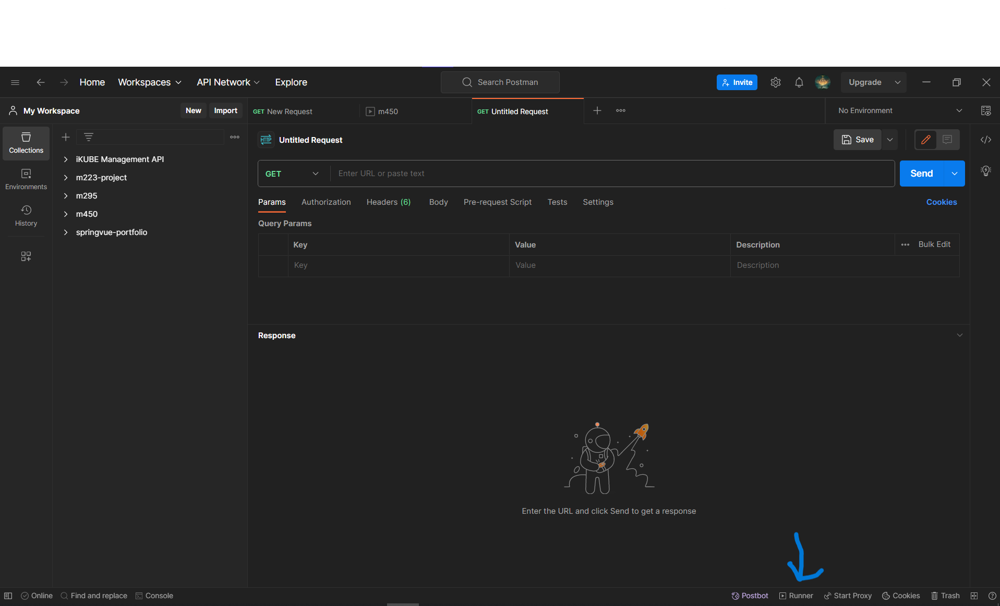
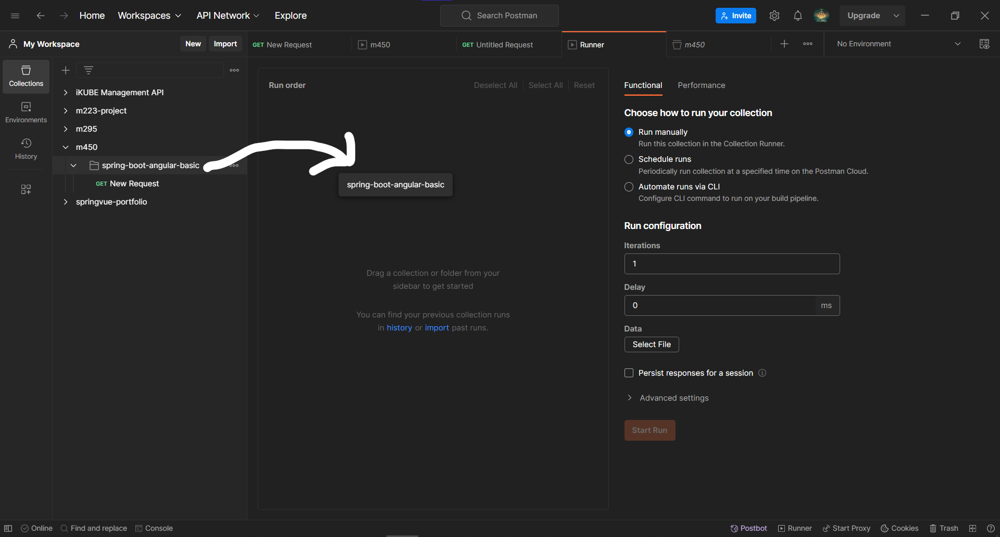
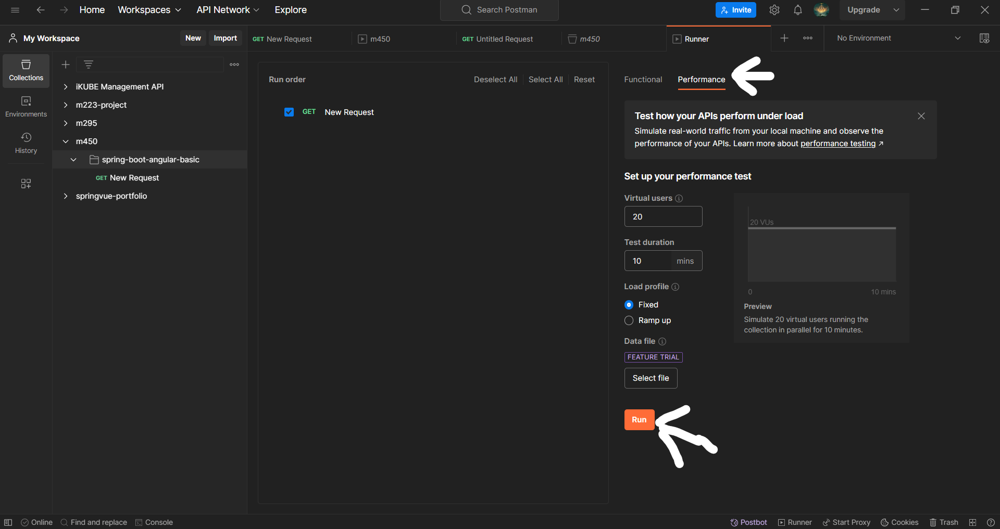
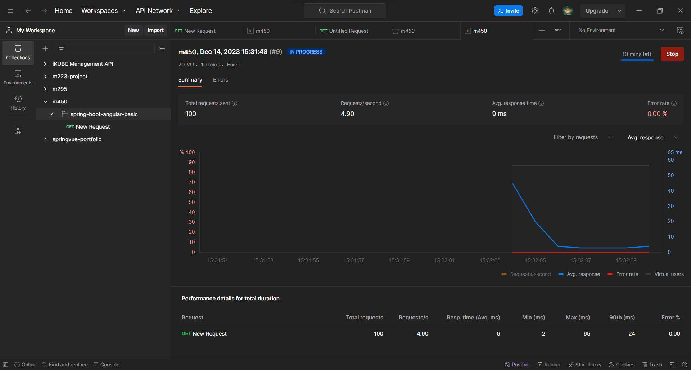

# How to run performance tests in Postman

1. Click on "Runner"   
2. Drag and Drop the folder with the performance tests into the "Run Order" field  
3. Switch to Performance and run it. You can also edit some setting to your preference here 
4. After the test is finished you can see the results 